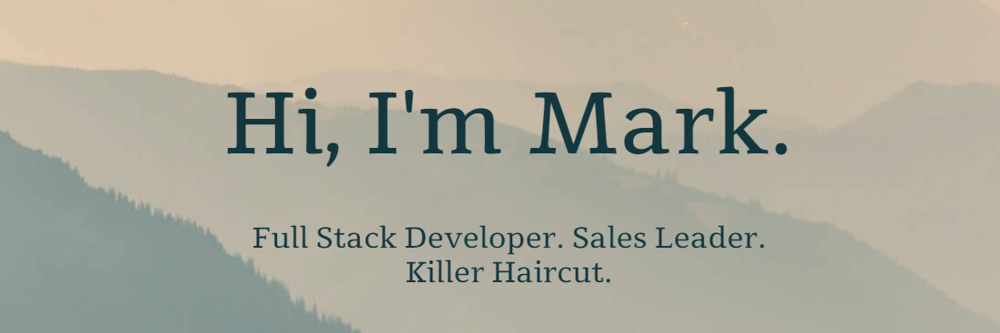

[](https://markdcross.dev)
# Hi, folks! 👋

## My name is [Mark Cross](https://markdcross.dev).

I'm currently enrolled in the University of Richmond Coding Bootcamp. Born and raised in Annapolis, MD, graduate of the University of Delaware (go Blue Hens 🐓), and now Richmond local. I've spent my career in sales and sales leadership, having recently served as the head of sales for Richmond-based startup, [EdConenctive](https://www.edconnective.com/ 'EdConnective').

## What I'm working on <g-emoji class="g-emoji" alias="man_technologist" fallback-src="https://github.githubassets.com/images/icons/emoji/unicode/1f468-1f4bb.png">👨‍💻</g-emoji>

    

 

   
 
    

## Stats


<!--START_SECTION:waka-->


**🐱 My Github Data** 

> 🏆 222 Contributions in the Year 2021
 > 
> 📦 255.1 kB Used in Github's Storage 
 > 
> 💼 Opted to Hire
 > 
> 📜 31 Public Repositories 
 > 
> 🔑 10 Private Repositories  
 > 
**I'm an Early 🐤** 

```text
🌞 Morning    169 commits    ███████████░░░░░░░░░░░░░░   45.68% 
🌆 Daytime    137 commits    █████████░░░░░░░░░░░░░░░░   37.03% 
🌃 Evening    64 commits     ████░░░░░░░░░░░░░░░░░░░░░   17.3% 
🌙 Night      0 commits      ░░░░░░░░░░░░░░░░░░░░░░░░░   0.0%

```
📅 **I'm Most Productive on Tuesday** 

```text
Monday       25 commits     █░░░░░░░░░░░░░░░░░░░░░░░░   6.76% 
Tuesday      121 commits    ████████░░░░░░░░░░░░░░░░░   32.7% 
Wednesday    64 commits     ████░░░░░░░░░░░░░░░░░░░░░   17.3% 
Thursday     57 commits     ███░░░░░░░░░░░░░░░░░░░░░░   15.41% 
Friday       24 commits     █░░░░░░░░░░░░░░░░░░░░░░░░   6.49% 
Saturday     60 commits     ████░░░░░░░░░░░░░░░░░░░░░   16.22% 
Sunday       19 commits     █░░░░░░░░░░░░░░░░░░░░░░░░   5.14%

```


📊 **This Week I Spent My Time On** 

```text
💬 Programming Languages: 
JavaScript               37 hrs 40 mins      ██████████████████░░░░░░░   73.48% 
CSS                      5 hrs 17 mins       ██░░░░░░░░░░░░░░░░░░░░░░░   10.32% 
JSON                     4 hrs 34 mins       ██░░░░░░░░░░░░░░░░░░░░░░░   8.92% 
Markdown                 2 hrs 10 mins       █░░░░░░░░░░░░░░░░░░░░░░░░   4.24% 
Other                    1 hr 9 mins         ░░░░░░░░░░░░░░░░░░░░░░░░░   2.25%

🔥 Editors: 
VS Code                  51 hrs 15 mins      █████████████████████████   100.0%

🐱‍💻 Projects: 
react-portfolio          27 hrs 27 mins      █████████████░░░░░░░░░░░░   53.58% 
perspektiv-v2            11 hrs 6 mins       █████░░░░░░░░░░░░░░░░░░░░   21.69% 
traversymedia-devcamper  7 hrs 30 mins       ███░░░░░░░░░░░░░░░░░░░░░░   14.66% 
ur-rich-fsf-pt-08-2020-u-3 hrs 20 mins       █░░░░░░░░░░░░░░░░░░░░░░░░   6.51% 
react-portfolio-practice 33 mins             ░░░░░░░░░░░░░░░░░░░░░░░░░   1.08%

```

**I Mostly Code in JavaScript** 

```text
JavaScript               23 repos            ██████████████░░░░░░░░░░░   58.97% 
HTML                     13 repos            ████████░░░░░░░░░░░░░░░░░   33.33% 
Ruby                     1 repo              ░░░░░░░░░░░░░░░░░░░░░░░░░   2.56% 
CSS                      1 repo              ░░░░░░░░░░░░░░░░░░░░░░░░░   2.56% 
Handlebars               1 repo              ░░░░░░░░░░░░░░░░░░░░░░░░░   2.56%

```

<!--END_SECTION:waka-->

<!-- ## Words of Affirmation

From our friends at [affirmations.dev](https://www.affirmations.dev/):

<p>{affirmation}</p>

Check back tomorrow for a new affirmation! -->

## Find me in the wild 🌎

[](http://markdcross.dev) [](https://www.linkedin.com/in/markdcross/)

<!--
**markdcross/markdcross** is a ✨ _special_ ✨ repository because its `README.md` (this file) appears on your GitHub profile.

