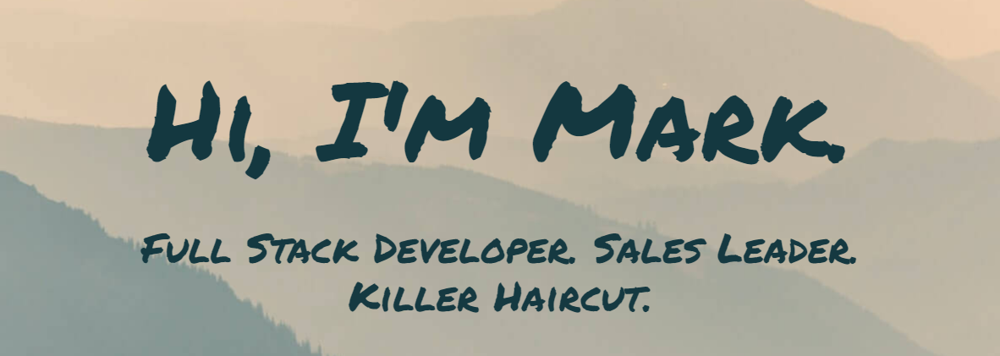

# Hi, folks! 👋

[](https://markdcross.dev)

## My name is [Mark Cross](https://markdcross.dev).

🧘 Let's start off on the right foot with some words of affirmation from our friends at [affirmations.dev](https://www.affirmations.dev/):

**_🌟It's not a mistake, it's a learning opportunity🌟_**

Check back at the top of the hour for a new affirmation!

#### Now where were we...

I'm currently enrolled in the University of Richmond Coding Bootcamp. Born and raised in Annapolis, MD, graduate of the University of Delaware (go Blue Hens 🐓), and now Richmond local. I've spent my career in sales and sales leadership, having recently served as the head of sales for Richmond-based startup, [EdConenctive](https://www.edconnective.com/ 'EdConnective'). Check out my virtual business card in your terminal:

```
npx markdcross
```

## <g-emoji class="g-emoji" alias="man_technologist" fallback-src="https://github.githubassets.com/images/icons/emoji/unicode/1f468-1f4bb.png">👨‍💻</g-emoji>What I'm working on 

     
     

<details>
<summary>🏹 Other arrows in my quiver </summary>

   

 

        

</details>

## 📈 Who doesn't love data? 


## 🌎 Find me in the wild 

[](http://markdcross.dev) [](https://www.linkedin.com/in/markdcross/)

<!--
**markdcross/markdcross** is a ✨ _special_ ✨ repository because its `README.md` (this file) appears on your GitHub profile.

